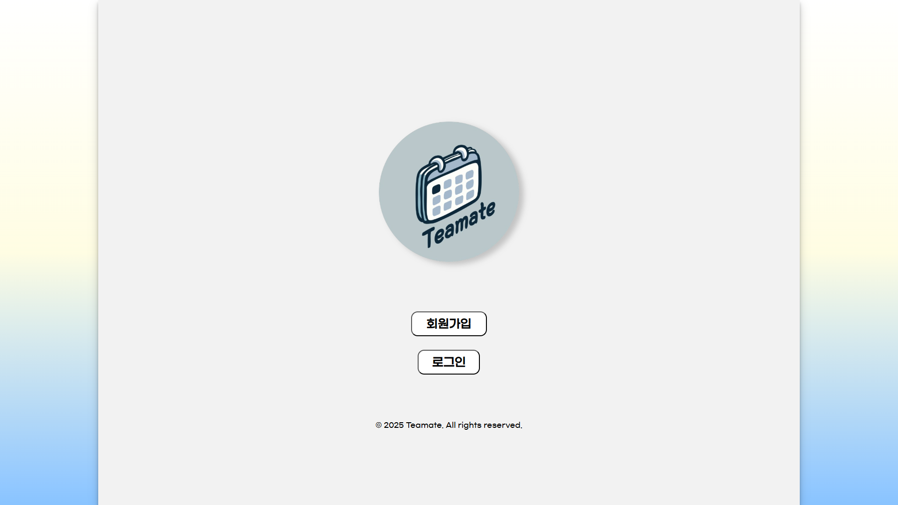
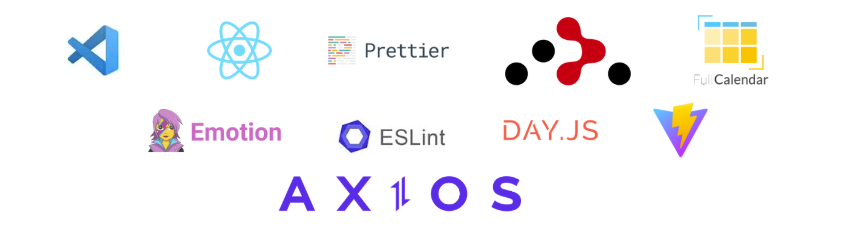

# 1차 팀메이트 프로젝트

### 프로젝트 기간 : 2024.12.16 ~ 2025.1.8

 

---

#### 소개

- 1차 Teamate 는 프로젝트 협업 관리 도구 입니다.
- 추후 개선 사항은 디자인 과 기능 추가 할 예정입니다.

---

#### 사용언어 및 라이브러리

#### 형상관리 도구

#### BackEnd 협업 도구

### 주요기능

- **팀장 : 이한샘**
  - **캘랜더**
    - 프로젝트 기간을 캘랜더 표시
    - 클릭시 프로젝트 구성 맴버 표시
  - **프로젝트 대시보드**
    - 프로젝트 목록 표시
    - 프로젝트 진행률 및 개인 진행률 표시
    - 프로젝트 구성원 표시
- **팀원 : 김기동**
  - **회원가입**
    - 메일 인증과 아이디 중복확인
    - 입력 필드의 유효성 검사
  - **프로젝트 구성원 상세보기**
    - 할일 등록, 수정, 삭제, 상세보기
    - 할일 완료 여부 및 개인 할일의 진행률 표시
    - 프로젝트 팀원 제외하기, 상태 알림메시지 제공
- **팀원 : 이유석**
  - **로그인**
    - 아이디, 비밀번호 찾기
    - 입력 필드의 유효성 검사
  - **유저 상세 페이지**
    - 유저 정보 출력
    - 유저 정보 변경 및 이미지 변경
